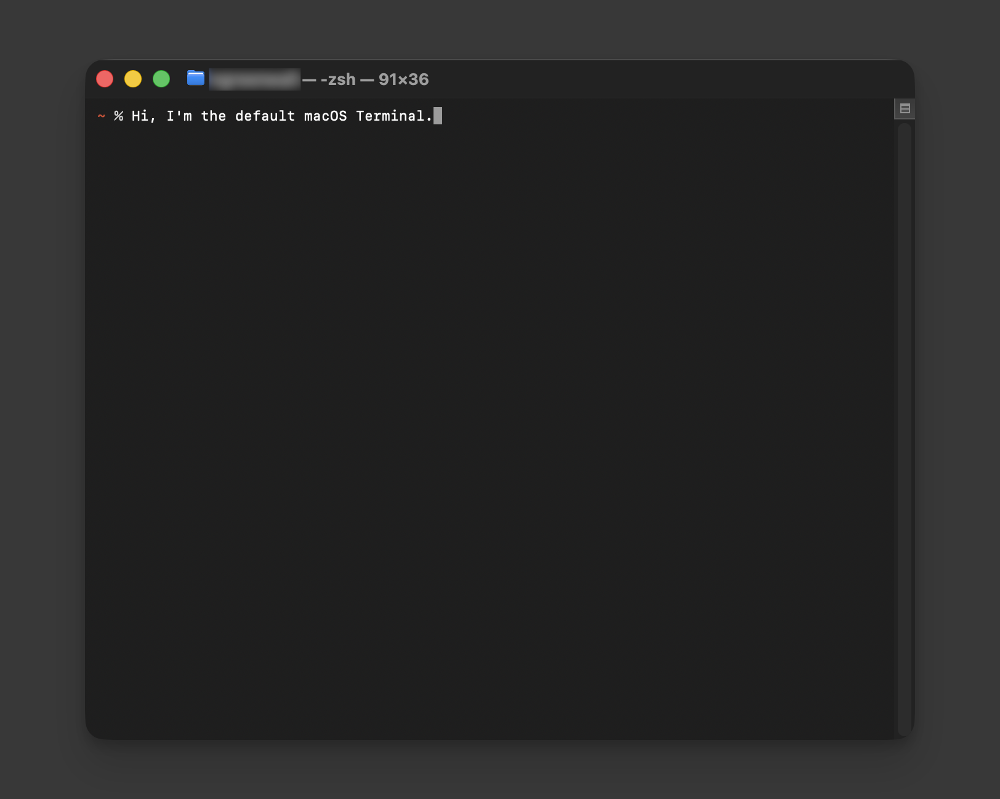
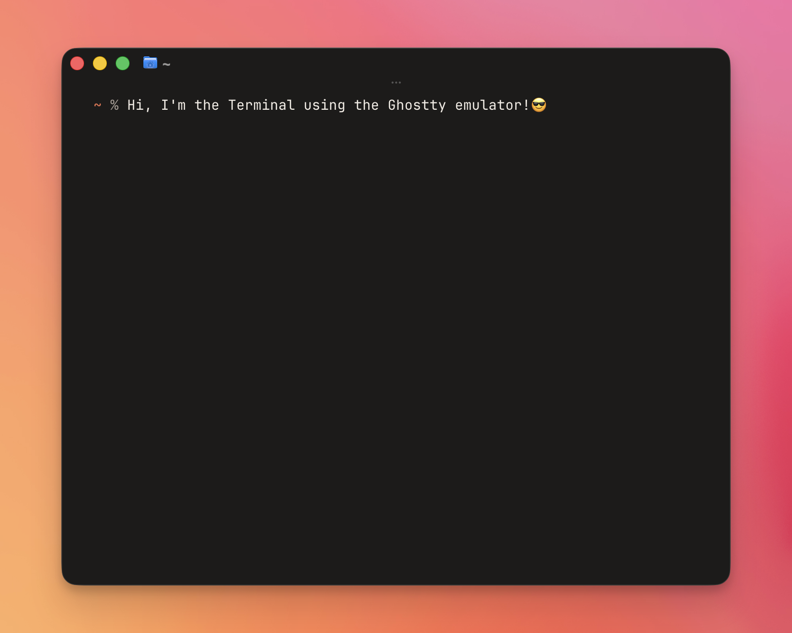
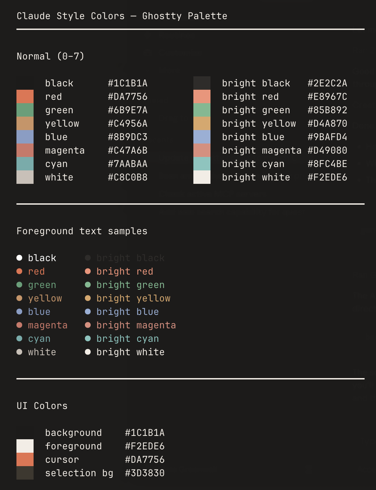

# Terminal Starter Kit

A beginner-friendly starting point for making your Mac terminal look and feel better. Includes a Claude-inspired color theme for [Ghostty](https://ghostty.org) (a fast, modern terminal app) and a starter `.zshrc` (the config file for Zsh, the default command-line shell on macOS).

New to the terminal? Start with [Using the Terminal](docs/using-the-terminal.md) before setting anything up below.

| Default Terminal | Ghostty, with this theme |
|---|---|
|  |  |

## What's in here

- `ghostty/ghostty-config.txt`: Settings for Ghostty. Colors, font, window padding, cursor style, and more. Every setting has an inline comment explaining what it does.
- `ghostty/palette-preview.png`, `ghostty/terminal-default.png`, `ghostty/terminal-ghostty.png`: Screenshots of the theme, including the before/after above.
- `zsh/starter-zshrc.txt`: A starter `.zshrc` file. Runs every time you open a new terminal window, and sets up things like command history, tab completion, and a colored prompt. Also has inline comments explaining each part.

## Ghostty: download and setup

**1. Download it.**

Easiest way, using [Homebrew](https://brew.sh) (a package manager, a tool for installing other software from the terminal):

```shell
brew install --cask ghostty
```

*What this does:* downloads and installs Ghostty, and keeps it updated automatically whenever you run `brew upgrade`.

Alternatively, download it directly from [ghostty.org](https://ghostty.org). If you already installed it this way and later switch to Homebrew, drag it out of your `Applications` folder first, then run the command above.

**2. Open the config file.**

Open Ghostty, then press `Cmd+,`. This opens Ghostty's settings file in a text editor.

Behind the scenes, that file lives at:
```
~/Library/Application Support/com.mitchellh.ghostty/config
```
(The `~` means your home folder. You don't need to navigate there manually, `Cmd+,` does it for you.)

**3. Add the theme.**

Copy everything from this repo's `ghostty/ghostty-config.txt` and paste it into the file Ghostty opened. Save the file.

**Claude-inspired color palette:**


Want a different look instead? See the built-in theme option near the top of `ghostty-config.txt`.

**4. Reload Ghostty.**

Press `Shift+Cmd+,` to apply the changes without restarting the app.

## The `.zshrc` file

`.zshrc` is a hidden config file for your terminal's shell (Zsh). It runs every time you open a new terminal window, and it's where you can set things like your prompt style, shortcuts (called aliases), and command history behavior.

**1. Open it.**

```shell
open -e ~/.zshrc
```
*What this does:* opens your `.zshrc` file in TextEdit. If the file doesn't exist yet, this command creates it.

**2. Add the starter config.**

Copy everything from this repo's `zsh/starter-zshrc.txt` and paste it into your `~/.zshrc`. Save the file.

**3. Apply the changes.**

```shell
source ~/.zshrc
```
*What this does:* reloads the file in your current terminal window immediately. Without this, the changes would only show up the next time you open a new window.

Every section in `starter-zshrc.txt` has a comment above it explaining what it does and why it's there, so it's worth a read through before you copy it over.

## Why "starter"

These files are a foundation, not a finished product. Read through the inline comments, decide what you like, and change anything to fit your own taste.
